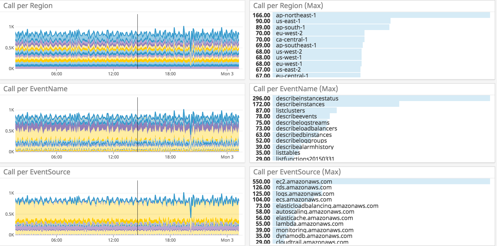

# dd-aws-apicall-metrics
Post AWS API Events metrics to Datadog

## Description

Send the number of user activities on aws to Datadog as metrics.  
By default, the user specifies for Datadog AWS Integration Role.

- CloudTrail Event history -> Lambda -> Datadog

Transfer setting for CloudTrail to S3 is no need.

- [AWS CloudTrail Features](https://aws.amazon.com/cloudtrail/features/?nc1=h_ls)

> You can view and download the last 90 days of your account activity for create, modify,
> and delete operations of supported services without the need to manually setup CloudTrail.

On Datadog:

```
custom metric:
  custom.user_name.events (specified for metricName)
tags:
  - host (as aws_account_id)
  - aws_account_id
  - aws_account_name
  - region
  - event_name
  - event_source
```



## Requirements

- [Datadog amazon_web_services](https://docs.datadoghq.com/integrations/amazon_web_services/)
- [Serverless Framework Documentation](https://serverless.com/framework/docs/)
- [Docker \- Build, Ship, and Run Any App, Anywhere](https://www.docker.com/)

# Usage

## IAM User

Create an IAM User for execution CloudFormation
and Set .aws/credential

- Allow Resource Policies

```
CloudFormation
CloudWatchEvents
CloudWatchLogs
IAM
KMS
Lambda
S3
```

### serverless-python-requirements

```bash
## install serverless-python-requirements
npm install --save serverless-python-requirements
## pull docker image
docker pull lambci/lambda:build-python3.6
```

## Configure

- e.g.) profile = default, stage = dev

```bash
_PROFILE="default"
_STAGE="dev"
cp conf/serverless.env.yml.example conf/${_PROFILE}.${_STAGE}.yml
# Input awsAccountName, userName, metricName
vi conf/${_PROFILE}.${_STAGE}.yml
sls info --profile ${_PROFILE} --stage ${_STAGE}
```

## Initial deploy

```bash
sls deploy --profile ${_PROFILE} --stage ${_STAGE} --verbose

# Input KMSArn to awsKmsKeyArn
vi conf/${_PROFILE}.${_STAGE}.yml
```

### KMS Key Setup

```bash
# Encrypt
_KEY_ID=$(grep 'awsKmsKeyArn:' conf/${_PROFILE}.${_STAGE}.yml | awk '{gsub(/"/,""); print $2}') ; echo ${_KEY_ID}
_REGION=$(grep 'region:' conf/${_PROFILE}.${_STAGE}.yml | awk '{gsub(/"/,""); print $2}') ; echo ${_REGION}
_TEXTs=(
"Your Datadog API Key"
"Your Datadog Application Key"
)
for _TEXT in ${_TEXTs[@]} ; do
  echo "-----"
  aws kms encrypt \
    --profile ${_PROFILE} \
    --region ${_REGION} \
    --key-id "${_KEY_ID}" \
    --plaintext "${_TEXT}" \
    --output text --query CiphertextBlob
  echo "-----"
done

# Input Encrypted Keys (kmsEncryptedHookUrl and kmsEncriptedToken"
vi conf/${_PROFILE}.${_STAGE}.yml

# Check
_ENCRYPTEDs=(
"$(grep 'kmsEncryptedDdApiKey:' conf/${_PROFILE}.${_STAGE}.yml | awk '{gsub(/"/,""); print $2}')"
"$(grep 'kmsEncryptedDdAppKey:' conf/${_PROFILE}.${_STAGE}.yml | awk '{gsub(/"/,""); print $2}')"
)
for _TEXT in ${_ENCRYPTEDs[@]} ; do
  echo "-----"
  aws kms decrypt \
    --profile ${_PROFILE} \
    --region ${_REGION} \
    --ciphertext-blob fileb://<(echo "${_TEXT}" | base64 --decode) \
    --output text --query Plaintext \
    | base64 --decode ; echo ""
  echo "-----"
done
```

## Deploy

```bash
sls deploy -f Main --profile ${_PROFILE} --stage ${_STAGE} --verbose
```

## Test Invoke

```bash
sls invoke -f Main -l --profile ${_PROFILE} --stage ${_STAGE} --verbose
```

## Remove

```bash
sls remove --profile ${_PROFILE} --stage ${_STAGE} --verbose
```
